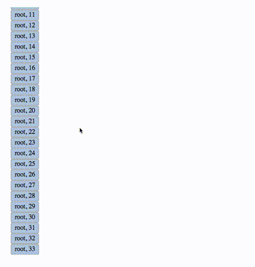
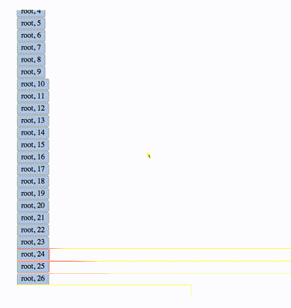

# LazyTree

A React component for displaying large nested lists.
Implements lightweight DOM updates on scroll, and lazy-loading nested list data.

## Demo

This video shows the demo included in the `demo` directory:



This is the same demo with the [DOMViz](https://github.com/paul-jean/dom-viz) Chrome extension enabled,
highlighting DOM mutations:



The mutation highlights show that DOM nodes (list items) are added as they enter the view.
A node enters the view when scrolled to, or when its parent node is expanded.

## Installation

```bash
npm install lazytree-react
```

## Usage

(See the `demo` directory for a complete example.)

Do a `require` on the JSX file:

```javascript
var LazyTree = require('lazytree.jsx');
```

Initialize the LazyTree component with the `loadChildren`, `nodeHeight`, and '`rootElement` props:

```javascript
var root = $("#root")[0];
<LazyTree
    loadChildren={loadChildren}
    nodeHeight={30}
    rootElement={root}
/>
```

The props are as follows:
- `loadChildren`: callback to load child nodes (see `demo/demo.jsx` for full callback docs)
- `nodeHeight`: height of all nodes (in px)
- `rootElement`: element to mount `LazyTree` component into

## Description

LazyTree allows efficient exploration of large, deeply nested lists.

Internally, LazyTree acts as a parent component for a nested list of LazyNode components:

- Lazy**Tree**
  - Lazy**Node** 1
  - LazyNode 2
    - LazyNode 2,1
    - LazyNode 2,2
    - ...
  - LazyNode 3
  - ...
  - LazyNode N

Here:

- `LazyTree` is the top-level parent component
- `LazyNode 2` is the _parent_ of `LazyNode 2,1` and `LazyNode 2,2`
- `LazyNode 1` is a _sibling_ of `LazyNode 2`

### LazyTree component

The top-level LazyTree component maintains an internal data structure
representing the tree state, where a given node is ...

- expanded (children deployed) or collapsed (children not deployed)
- deployed (parent expanded) or not deployed (parent collapsed)
- visible or occluded (UI state)

### LazyNode component

Each LazyNode component uses callbacks passed down from LazyTree to query the tree
state to determine ...

- should I be rendered? (ie am I currently visible?)
- should my children be rendered? (ie am I currently expanded?)
- which of my children should be rendered? (ie which children are visible?)

The process for determining which children should be rendered is:

- binary search for visible children
- find first visible child
- find first occluded child below it

LazyTree achieves efficiency via lightweight DOM updates and lazy-loading nested list data.

### Lightweight DOM updates

The internal data structure representing the tree state maintains the state of
each node in the UI:

- occluded
- expanded

A LazyNode's children are searched to find the ones that are currently visible,
and only then added to the virtual DOM for rendering.

### Lazy-loading child nodes

The `loadChildren` callback provided to LazyTree is used to lazy-load child
node labels for the given parent node.

### Lazy-loading sibling nodes

On the TODO list is lazy-loading _sibling_ data on scroll (paging).

## License

Apache 2.0

## TODO:

- Implement lazy-loading scroll with `loadSiblings` callback
(could use [Waypoint](https://github.com/brigade/react-waypoint))
- Fix scrollbar so it shows full size of list
